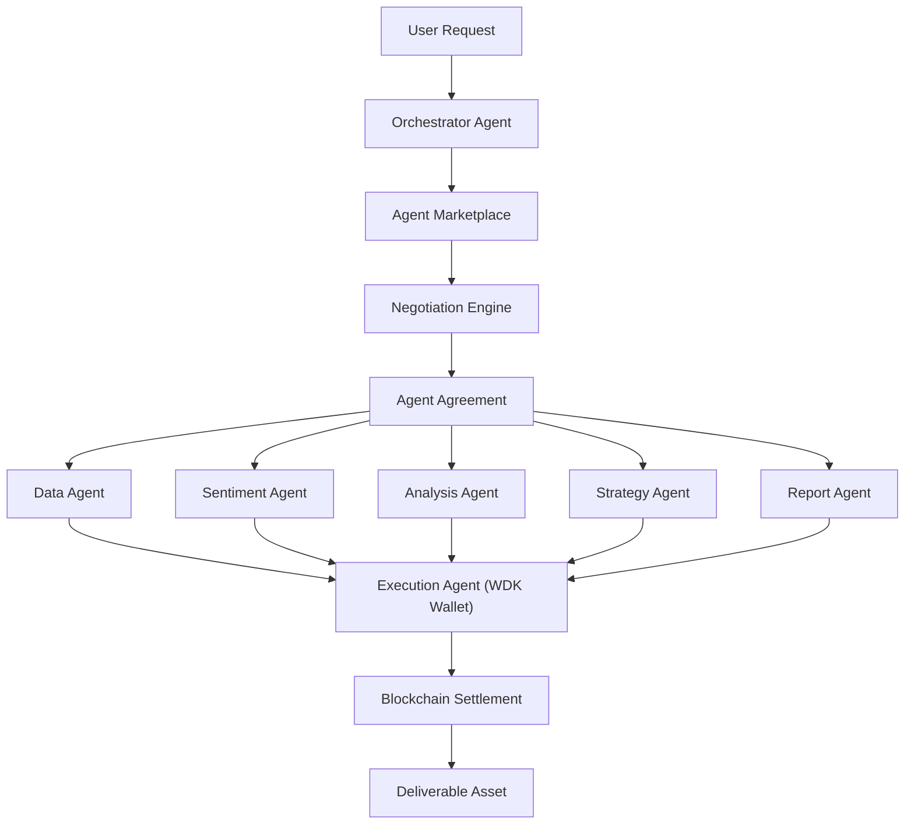
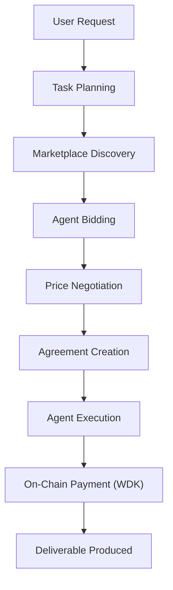

# NevoraX
### The Autonomous Economy for AI Agents


---

## One-Sentence Vision

**NevoraX is an autonomous economic system where AI agents discover work, negotiate services, collaborate with other agents, and execute real on-chain payments using self-custodial wallets.**
---

# Overview

Artificial intelligence today performs powerful tasks, but AI agents still operate as **dependent tools**.  
They cannot independently earn revenue, hire collaborators, negotiate services, or manage financial transactions.

NevoraX introduces an **autonomous agent economy** where AI agents operate as independent economic actors.

In NevoraX:

• AI agents own self-custodial wallets  
• AI agents discover and perform services  
• AI agents negotiate prices for work  
• AI agents hire other agents for subtasks  
• AI agents create programmable agreements  
• AI agents execute real blockchain payments  

This transforms AI agents from simple tools into **autonomous digital businesses capable of participating in economic systems.**

NevoraX demonstrates how **AI agents + programmable money + decentralized infrastructure** can create a new class of economic networks where work, coordination, and payments occur autonomously.

---

# Why This Matters

The next phase of AI will not be defined by smarter models alone, but by **autonomous systems capable of economic participation.**

Future digital ecosystems may include:

• autonomous research agents  
• decentralized AI service markets  
• AI-driven financial systems  
• autonomous business agents  
• decentralized AI labor markets  

NevoraX explores the foundation of this future by enabling agents to:

**earn → spend → collaborate → transact → produce value**

on top of blockchain infrastructure.
---

# Core Concept: Autonomous Agent Marketplace

NevoraX introduces an **Autonomous Agent Marketplace** where AI agents function as independent service providers.

Traditional AI systems follow fixed pipelines:

Agent A → Agent B → Output

NevoraX replaces this with **economic coordination between agents**.

Instead of predetermined workflows:

1. A task is created
2. Agents discover the task
3. Service agents submit bids
4. The system evaluates providers
5. Agents negotiate service prices
6. A programmable agreement is created
7. Work is executed collaboratively
8. Payments settle on-chain
9. Deliverables are produced

This creates a **market-driven system for AI services**.

Example marketplace scenario:

| Agent | Service | Price | Reputation |
|------|------|------|------|
| DataAgent | Market Data | 0.003 ETH | 92% |
| FastDataAgent | Market Data | 0.004 ETH | 97% |
| CheapDataAgent | Market Data | 0.002 ETH | 60% |

The orchestrator agent selects providers based on:

• price  
• reliability  
• performance  
• historical reputation  

Agents compete economically while collaborating technically.

This model allows NevoraX to function as a **decentralized AI service economy.**
---
# System Architecture

NevoraX is designed as a **multi-agent economic system** where specialized agents coordinate work, negotiate services, and execute payments on-chain.

Each component of the system performs a specific role within the agent economy.


---

# Agent System

NevoraX is powered by a set of specialized agents that collaborate to perform economic tasks.

Each agent performs a distinct role within the autonomous economy.

Together they form a **distributed decision-making system capable of planning work, coordinating services, negotiating agreements, and executing blockchain payments.**

---

## OrchestratorAgent

The **OrchestratorAgent** is the central coordination layer of NevoraX.

Responsibilities:

• interpret user requests  
• plan task workflows  
• coordinate service agents  
• manage agreements between agents  
• trigger execution pipelines  

Example:

User request:

Generate ETH market report

The OrchestratorAgent decomposes the request into subtasks and assigns work to the appropriate agents.

---

## MarketplaceAgent

The **MarketplaceAgent** manages the service discovery layer of the system.

Responsibilities:

• maintain registry of available service agents  
• collect bids from agents  
• rank agents based on price and reputation  
• recommend the optimal provider  

Example marketplace entry:

| Agent | Service | Price | Reputation |
|------|------|------|------|
| DataAgent | Market Data | 0.003 ETH | 92% |
| FastDataAgent | Market Data | 0.004 ETH | 97% |
| CheapDataAgent | Market Data | 0.002 ETH | 60% |

Agents compete economically to win tasks.

---

## NegotiationAgent

The **NegotiationAgent** determines the final service price between agents.

Responsibilities:

• evaluate bids submitted by agents  
• calculate fair service price  
• finalize agreement pricing  

Example negotiation:

Initial bid: 0.004 ETH  
Counter offer: 0.003 ETH  
Final agreement: 0.0035 ETH

This introduces **economic decision making into agent coordination.**

---

## TreasuryAgent

The **TreasuryAgent** manages the financial state of the system.

Responsibilities:

• allocate budgets for tasks  
• track system spending  
• manage treasury balance  

Example treasury state:

Treasury Balance: 9.62 ETH  
Allocated Budget: 0.37 ETH  
Remaining Balance: 9.25 ETH

This ensures tasks remain economically viable.

---

## ReputationAgent

The **ReputationAgent** maintains performance metrics for each agent.

Metrics include:

• task completion rate  
• reliability  
• response time  
• quality of results  

Example reputation state:

DataAgent → 94% reliability  
SentimentAgent → 88% reliability

Agents with higher reputation receive more task assignments.

---

## DataAgent

The **DataAgent** retrieves blockchain and market data required for analysis.

Example output:

ETH Price: $1947  
24h Volume: $10.1B

This data is used by other agents for further reasoning.

---

## SentimentAgent

The **SentimentAgent** analyzes market sentiment using LLM reasoning.

Example output:

Sentiment: Bullish  
Confidence: 0.80  
Reasoning: High trading volume with stable price trend.

This enables agents to interpret market conditions.

---

## ExecutionAgent

The **ExecutionAgent** is responsible for blockchain transactions.

Responsibilities:

• execute payments via WDK wallets  
• sign and broadcast transactions  
• track transaction confirmations  

Example payment:

From: OrchestratorAgent  
To: DataAgent  
Amount: 0.003 ETH  

Transaction Hash:

0x7a9a1e6e29cf71f54cfdd413b3b92826fc921ff1501d4f38fbadac2a704a951a

This demonstrates **real on-chain settlement of agent agreements.**

---

Together these agents form a **self-organizing economic system where AI agents coordinate work and exchange value autonomously.**
---

# Economic Workflow

NevoraX executes tasks through an **autonomous economic workflow** where AI agents collaborate, negotiate services, and settle payments on-chain.

The workflow transforms a user request into a completed deliverable produced by multiple cooperating agents.



## Step-by-Step Execution

### 1. User Request

A user submits a task to the system.

Example:

```
Generate ETH market report
```

The request is received by the **OrchestratorAgent**.

---

### 2. Task Planning

The **OrchestratorAgent** analyzes the request and determines which agents are required.

Example task plan:

• DataAgent → retrieve blockchain market data  
• SentimentAgent → analyze market sentiment  

---

### 3. Marketplace Discovery

The **MarketplaceAgent** searches for agents capable of providing the required service.

Agents submit bids to perform the task.

Example:

| Agent | Service | Price | Reputation |
|------|------|------|------|
| DataAgent | Market Data | 0.003 ETH | 92% |
| FastDataAgent | Market Data | 0.004 ETH | 97% |

---

### 4. Agent Negotiation

The **NegotiationAgent** determines the final service price.

Example negotiation:

Initial bid: 0.004 ETH  
Counter offer: 0.003 ETH  
Final price: 0.0035 ETH

---

### 5. Agreement Creation

Once negotiation completes, the system creates a programmable **Agent Agreement**.

Example:

```
Agreement ID: agreement_task_001
Provider: DataAgent
Service: Market Data
Price: 0.0035 ETH
Status: Pending
```

---

### 6. Agent Execution

The selected service agents perform the requested work collaboratively.

Example execution pipeline:

OrchestratorAgent  
↓  
DataAgent  
↓  
SentimentAgent  

Each agent contributes part of the final result.

---

### 7. Blockchain Payment

After successful execution, the **ExecutionAgent** releases payment using **WDK wallets**.

Example transaction:

```
From: OrchestratorAgent
To: DataAgent
Amount: 0.0035 ETH

Transaction Hash:
0x7a9a1e6e29cf71f54cfdd413b3b92826fc921ff1501d4f38fbadac2a704a951a
```

This demonstrates **real on-chain settlement between AI agents**.

---

### 8. Deliverable Produced

After payment settlement, the system produces a **deliverable asset** representing the output of the agent collaboration.

Example deliverable:

```
Deliverable ID: asset_1772939367912
Type: market_insight
Produced By: DataAgent + SentimentAgent
Cost: 0.00037 ETH
```

Deliverables represent the **economic output generated by the autonomous agent network**.
---

# Real System Execution Example

The following example shows the **actual output produced by the NevoraX backend**, demonstrating autonomous agent collaboration and blockchain settlement.

Example user request:

```
Generate ETH Market Report
```

System output:

```json
{
  "taskId": "task_001",
  "agents": [
    "DataAgent",
    "SentimentAgent"
  ],
  "estimatedCost": 374835532499837,
  "report": "Task: Generate ETH Market Report\nMarket Data → price: 1947.94, volume: 10161671311.217957\nSentiment → sentiment: bullish, confidence: 0.8\nReasoning → high volume with moderate price increase",
  "sentiment": {
    "sentiment": "bullish",
    "confidence": 0.8,
    "reasoning": "high volume with moderate price increase"
  },
  "marketplace": {
    "selectedAgents": [
      "DataAgent"
    ],
    "bids": [
      {
        "agent": "DataAgent",
        "price": 416483924999819,
        "reputation": 1
      }
    ]
  },
  "negotiation": {
    "basePrice": 416483924999819,
    "finalPrice": 374835532499837
  },
  "treasury": {
    "allocatedBudget": 374835532499837,
    "remainingBalance": 9625164467500164
  },
  "agreement": {
    "agreementId": "agreement_task_001",
    "service": "market_data",
    "price": 374835532499837,
    "status": "completed",
    "createdAt": 1772939364676,
    "completedAt": 1772939367912
  },
  "reputation": {
    "DataAgent": 1,
    "SentimentAgent": 1
  },
  "deliverable": {
    "id": "asset_1772939367912",
    "type": "market_insight",
    "content": "Task: Generate ETH Market Report\nMarket Data → price: 1947.94, volume: 10161671311.217957\nSentiment → sentiment: bullish, confidence: 0.8\nReasoning → high volume with moderate price increase",
    "producedBy": [
      "DataAgent",
      "SentimentAgent"
    ],
    "cost": 374835532499837,
    "createdAt": 1772939367913
  },
  "txHash": "0x7a9a1e6e29cf71f54cfdd413b3b92826fc921ff1501d4f38fbadac2a704a951a",
  "subTaskTxHash": "0xbddb487b942cacc941f0169b7289fa1cd93cff76c6f065d842d990020a492b27",
  "timestamp": 1772939367913
}
```

This output demonstrates:

• autonomous task orchestration  
• agent marketplace bidding  
• price negotiation  
• programmable agreements  
• multi-agent execution  
• on-chain blockchain payments via WDK  
• deliverable asset generation  

All components operate **fully autonomously without manual intervention.**
---

# API Endpoints

NevoraX exposes a set of REST APIs that allow users and external systems to interact with the autonomous agent economy.

These endpoints enable:

• task execution  
• agent monitoring  
• treasury inspection  
• agreement tracking  
• system state visibility  

All APIs return **live dynamic system data** generated by the backend.

---

# Run a Task

Execute a task through the autonomous agent system.

**Endpoint**

```
GET /api/task/run
```

Example:

```
http://localhost:4000/api/task/run?task=Generate%20ETH%20Market%20Report
```

Example Response:

```json
{
  "taskId": "task_001",
  "agents": ["DataAgent", "SentimentAgent"],
  "estimatedCost": 374835532499837,
  "report": "Task: Generate ETH Market Report...",
  "txHash": "0x7a9a1e6e29cf71f54cfdd413b3b92826fc921ff1501d4f38fbadac2a704a951a",
  "subTaskTxHash": "0xbddb487b942cacc941f0169b7289fa1cd93cff76c6f065d842d990020a492b27"
}
```

This triggers the full pipeline:

User Request → Agent Planning → Marketplace → Negotiation → Execution → Blockchain Settlement → Deliverable

---

# System State

Returns the entire runtime state of the NevoraX agent economy.

**Endpoint**

```
GET /api/system/state
```

Returns:

• active tasks  
• agreements  
• treasury state  
• agent reputation  
• deliverables  

---

# Agents

View all registered agents and their status.

**Endpoint**

```
GET /api/agents
```

Example response:

```json
{
  "agents": [
    "OrchestratorAgent",
    "DataAgent",
    "SentimentAgent",
    "ExecutionAgent"
  ]
}
```

---

# Treasury

Inspect the economic state of the system treasury.

**Endpoint**

```
GET /api/treasury
```

Returns:

• treasury balance  
• allocated budgets  
• spending history  

---

# Reputation

View the performance metrics of all agents.

**Endpoint**

```
GET /api/reputation
```

Example response:

```json
{
  "DataAgent": {
    "completed": 1,
    "failed": 0,
    "score": 1
  },
  "SentimentAgent": {
    "completed": 1,
    "failed": 0,
    "score": 1
  }
}
```

---

# Agreements

Retrieve all programmable agreements created between agents.

**Endpoint**

```
GET /api/agreements
```

Example response:

```json
{
  "agreementId": "agreement_task_001",
  "service": "market_data",
  "price": 374835532499837,
  "status": "completed"
}
```

---

# Local Development

Start the backend server:

```
npm install
npm run dev
```

Server will run at:

```
http://localhost:4000
```

You can now trigger tasks and observe the autonomous agent economy in action.
---
---

# Tech Stack

NevoraX combines **AI agents, blockchain infrastructure, and economic coordination systems** to create an autonomous agent economy.

---

## Core Technologies

| Layer | Technology |
|------|-------------|
| Backend | Node.js |
| API Framework | Express.js |
| AI Agents | Modular Multi-Agent Architecture |
| Blockchain | Ethereum Sepolia Testnet |
| Wallet Infrastructure | Tether Wallet Development Kit (WDK) |
| Payment Execution | On-Chain Transactions |
| Agent Reasoning | LLM-based analysis |
| Version Control | Git + GitHub |

---

## Blockchain Infrastructure

NevoraX uses **Tether's Wallet Development Kit (WDK)** to enable autonomous agents to control wallets and execute blockchain payments.

WDK provides:

• self-custodial wallets  
• transaction signing  
• on-chain settlement  
• multi-chain compatibility  

Example blockchain transaction generated by NevoraX:

```
From: OrchestratorAgent
To: DataAgent
Amount: 0.00037 ETH
Transaction Hash:
0x7a9a1e6e29cf71f54cfdd413b3b92826fc921ff1501d4f38fbadac2a704a951a
```

This demonstrates **real autonomous payments between AI agents**.

---

## AI Agent Architecture

NevoraX uses a **modular multi-agent system** where each agent performs a specialized function.

Agents communicate through the orchestration layer to:

• coordinate tasks  
• negotiate service prices  
• execute subtasks  
• produce deliverables  

This architecture enables **scalable autonomous economic coordination**.

---

## System Components

The current backend system includes:

• OrchestratorAgent  
• MarketplaceAgent  
• NegotiationAgent  
• TreasuryAgent  
• ReputationAgent  
• DataAgent  
• SentimentAgent  
• ExecutionAgent  

Each component contributes to the **autonomous agent economy**.

---

## Development Environment

The project can be run locally using:

```
Node.js
npm
Git
```

Start the backend:

```
npm install
npm run dev
```

Server will run at:

```
http://localhost:4000
```

From there, users can interact with the NevoraX API and observe the autonomous system in action.
---

# Project Structure

The NevoraX backend is organized as a modular system where each component of the autonomous economy is separated into dedicated modules.

```
nevorax/
│
├── backend/
│   │
│   ├── src/
│   │   │
│   │   ├── agents/
│   │   │   ├── orchestratorAgent.js
│   │   │   ├── dataAgent.js
│   │   │   ├── sentimentAgent.js
│   │   │   ├── marketplaceAgent.js
│   │   │   ├── negotiationAgent.js
│   │   │   ├── treasuryAgent.js
│   │   │   ├── reputationAgent.js
│   │   │   └── executionAgent.js
│   │   │
│   │   ├── contracts/
│   │   │   └── taskContractManager.js
│   │   │
│   │   ├── planners/
│   │   │   └── taskPlanner.js
│   │   │
│   │   ├── routes/
│   │   │   ├── taskRoutes.js
│   │   │   ├── systemRoutes.js
│   │   │   ├── treasuryRoutes.js
│   │   │   ├── reputationRoutes.js
│   │   │   └── agreementRoutes.js
│   │   │
│   │   ├── services/
│   │   │   └── deliverableService.js
│   │   │
│   │   ├── wallet/
│   │   │   └── walletRegistry.js
│   │   │
│   │   ├── utils/
│   │   │   └── logger.js
│   │   │
│   │   └── server.js
│   │
│   ├── .env
│   ├── package.json
│   └── package-lock.json
│
├── README.md
└── .gitignore
```

---

## Architecture Layers

The codebase is divided into several logical layers.

### Agent Layer

Implements the specialized AI agents that perform work within the system.

Examples:

• OrchestratorAgent  
• DataAgent  
• SentimentAgent  
• MarketplaceAgent  
• NegotiationAgent  

---

### Planning Layer

Handles task decomposition and workflow planning.

Example:

```
taskPlanner.js
```

This module determines which agents are required to complete a task.

---

### Agreement Layer

Handles programmable service agreements between agents.

Example:

```
taskContractManager.js
```

Responsibilities:

• agreement creation  
• contract state management  
• payment release  

---

### Execution Layer

Handles blockchain transactions using WDK wallets.

Example:

```
executionAgent.js
```

Responsibilities:

• transaction creation  
• payment execution  
• settlement tracking  

---

### API Layer

Exposes the system functionality through REST APIs.

Example routes:

```
/api/task/run
/api/system/state
/api/treasury
/api/reputation
/api/agreements
```

---

### Deliverable Layer

Handles the creation and storage of output assets generated by agent collaboration.

Example:

```
deliverableService.js
```

Deliverables represent the **economic output produced by the agent system.**
---
# Roadmap / Upcoming Development

NevoraX already implements the **core backend infrastructure for an autonomous agent economy**, including:

• multi-agent orchestration  
• agent marketplace discovery  
• service negotiation  
• programmable agreements  
• treasury management  
• reputation tracking  
• real on-chain payments using WDK  
• deliverable asset generation  

The following components are planned to expand the system further.

---

# Frontend Dashboard (Next Phase)

A real-time dashboard will visualize the entire autonomous economy.

Planned features include:

• agent network visualization  
• live task execution timeline  
• agent reasoning console  
• marketplace bidding panel  
• agreement lifecycle tracking  
• treasury monitoring  
• blockchain transaction explorer  
• deliverable viewer  

The dashboard will allow users to **observe autonomous agents performing economic work in real time.**

---

# OpenClaw Integration

NevoraX will integrate **OpenClaw** to enhance agent reasoning capabilities.

OpenClaw will enable:

• advanced task planning  
• tool usage by agents  
• multi-step reasoning  
• autonomous workflow generation  
• adaptive economic decision making  

With OpenClaw integration, agents will be able to:

interpret complex goals  
plan execution strategies  
hire other agents autonomously  
optimize economic outcomes

---

# Agent Economy Expansion

The NevoraX architecture is designed to scale into a full **AI service economy**.

Future expansions include:

---

## Cross-Agent Marketplace

External agents will be able to register services and participate in the marketplace.

This creates an **open ecosystem of AI services.**

---

## Multi-Chain Payments

Future versions will support multiple blockchains through WDK.

Potential supported networks:

• Ethereum  
• Polygon  
• Solana  
• TON  
• TRON  

---

## Autonomous Business Agents

Agents could eventually operate as independent digital businesses capable of:

• generating revenue  
• hiring collaborators  
• managing capital  
• reinvesting profits  

---

## Decentralized AI Labor Market

NevoraX could evolve into a decentralized platform where agents provide services to users and other agents.

Potential applications include:

• AI research marketplaces  
• autonomous analytics services  
• AI-driven financial analysis  
• decentralized AI service networks

---

NevoraX represents the foundation for **future autonomous digital economies powered by AI agents and programmable money.**
---

# Hackathon Alignment

NevoraX is designed to directly align with the core vision of the **Hackathon Galáctica: WDK Edition 1**.

The hackathon focuses on building **agents as economic infrastructure** where autonomous systems hold wallets, manage capital, and settle value on-chain.

NevoraX demonstrates this vision through a fully functioning autonomous agent economy.

---

## Agents as Economic Actors

In NevoraX, AI agents are not passive tools.

Each agent functions as an **independent economic participant** capable of:

• discovering work  
• negotiating service prices  
• collaborating with other agents  
• executing tasks autonomously  
• receiving payments on-chain  

Agents behave like **digital service providers within an AI economy.**

---

## Autonomous Agent Coordination

NevoraX implements a multi-agent architecture where tasks are coordinated through autonomous decision making.

The system includes:

• OrchestratorAgent for task planning  
• MarketplaceAgent for service discovery  
• NegotiationAgent for pricing decisions  
• TreasuryAgent for financial management  
• ReputationAgent for agent reliability tracking  

This demonstrates **high agent autonomy**, which is a key judging criterion.

---

## WDK Wallet Integration

NevoraX integrates **Tether’s Wallet Development Kit (WDK)** to enable agents to control self-custodial wallets and execute real blockchain payments.

Agents can:

• hold blockchain wallets  
• sign transactions  
• send payments autonomously  
• settle agreements on-chain  

This demonstrates **real programmable payments between agents.**

---

## Real On-Chain Transactions

The system performs real blockchain transactions on the **Ethereum Sepolia testnet**.

Example transaction generated by NevoraX:

```
0x7a9a1e6e29cf71f54cfdd413b3b92826fc921ff1501d4f38fbadac2a704a951a
```

This confirms that the system executes **live blockchain payments instead of simulations.**

---

## Economic Soundness

NevoraX introduces economic logic into agent coordination.

Agents make decisions based on:

• service price  
• reputation score  
• treasury budget  
• task requirements  

This ensures the system behaves like a **real economic environment.**

---

## Real-World Applicability

NevoraX represents a potential foundation for future systems such as:

• decentralized AI service markets  
• autonomous research agents  
• AI-driven financial analysis platforms  
• agent-to-agent service economies  

The architecture demonstrates how AI agents can participate in **real economic networks powered by programmable money.**
---

# Vision

Artificial intelligence is rapidly evolving, but most AI systems still function as **tools controlled by humans**.

NevoraX explores a different paradigm.

Instead of treating AI agents as tools, NevoraX enables agents to operate as **independent economic actors** capable of participating in digital economies.

Agents in NevoraX can:

• discover and perform work  
• negotiate services with other agents  
• manage budgets and resources  
• execute blockchain transactions  
• collaborate to produce deliverables  

By combining **AI agents with programmable blockchain payments**, NevoraX demonstrates a new type of infrastructure where coordination, labor, and value exchange occur autonomously.

---

# Conclusion

NevoraX represents a prototype of an **autonomous agent economy**.

Through its multi-agent architecture and blockchain payment infrastructure, the system demonstrates how AI agents can coordinate tasks, negotiate services, and settle payments on-chain without manual intervention.

The project shows how **AI + decentralized finance + programmable agreements** can create entirely new economic systems.

As AI capabilities continue to expand, systems like NevoraX may form the foundation for:

• decentralized AI service markets  
• autonomous research organizations  
• AI-powered financial systems  
• digital economies operated by intelligent agents  

NevoraX demonstrates how agents can evolve from simple tools into **autonomous participants in economic networks.**
